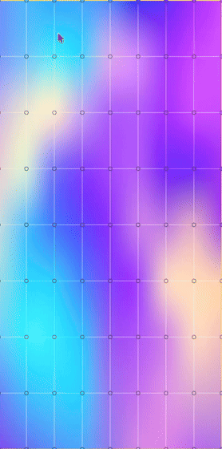
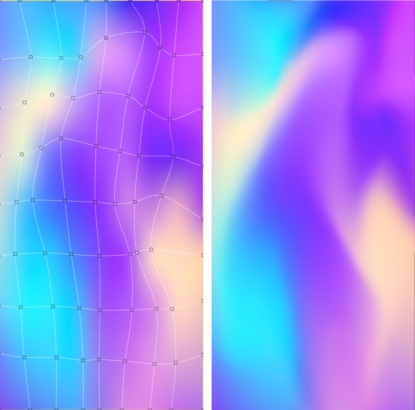
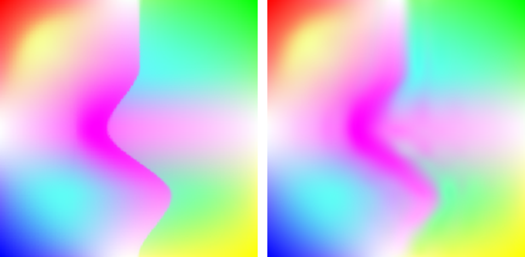

# Gradient Mesh C++ Implementation

**Gradient Mesh Studio** — an open-source, from-scratch **C++17 implementation of image vectorization with optimized gradient meshes** (Sun, Liang, Wen & Shum, *ACM Transactions on Graphics* 2007), with an interactive macOS app and **SVG2 `<meshgradient>` export**. It turns a raster image into an editable, resolution-independent gradient mesh: a grid of control points, each carrying a position *and* a colour, joined by smooth bicubic (Ferguson/Hermite) patches and fitted to the picture by minimising reconstruction error.



<sub>The macOS app animating a fitted gradient mesh (control points and patch edges drawn over the reconstruction).</sub>

[](https://en.cppreference.com/w/cpp/17)
[](https://cmake.org/)
[](#how-to-build)
[-black?logo=apple)](#build-the-macos-app)
[](#testing)
[](LICENSE)

**Contents:** [Features](#features) · [Demo](#demo) · [Dependencies](#dependencies) · [How to Build](#how-to-build) · [Usage](#usage) · [How it works](#how-it-works) · [Project layout](#project-layout) · [Testing](#testing) · [Known limitations](#known-limitations) · [FAQ](#faq) · [Citation](#citation) · [License](#license)

---

## Features

**Algorithm library (`gmcore`) — portable C++17, no GUI, no required third-party dependencies**

- **Gradient mesh model** — rectangular grids of control points with per-vertex position, tangents and colour, evaluated as bicubic Ferguson (Hermite) patches, exactly the representation of Sun et al. 2007, Sec. 3–4.
- **Energy-minimising optimiser** — fits geometry and colour to the image with data, smoothness, boundary and vector-line terms (Levenberg–Marquardt-style), solved **coarse-to-fine over a Gaussian pyramid**. Includes a block-sparse PCG solver written for this project.
- **Boundary-aware fitting** — each of the mesh's four sides is a multi-segment cubic Bézier spline, so non-convex silhouettes are tracked; boundary vertices stay on their spline while they optimise.
- **Vector lines** — optional user-drawn guide polylines that pull nearby mesh edges into alignment with a highlight or a fold.
- **Interactive cut-out** — Lazy-Snapping-style graph-cut segmentation (max-flow) plus contour tracing, to get the object outline the mesh is fitted inside.
- **Optional CIELUV colour space** for perceptually uniform colour interpolation.
- **SVG export** — writes a real SVG2 `<meshgradient>`/`<meshpatch>` document, so the mesh stays an editable vector object (e.g. in Inkscape).
- **Optional Ceres Solver backends** — geometry-only and joint geometry+colour solvers, used only if [Ceres](http://ceres-solver.org/) is found at configure time.
- **Command-line tool** (`gmesh_cli`) and a **regression suite** (`gmcore_tests`) that build anywhere CMake and a C++17 compiler do.

**macOS app (`GradientMeshStudio.app`) — AppKit, Objective-C++**

- Open an image, trace an outline or cut the object out, pick four corners, set the mesh resolution, and **Optimize** with live RMSE per pyramid level.
- **Edit the mesh by hand** — drag control points, repaint a vertex's colour.
- **Export** the reconstruction as PNG and the mesh as SVG.
- **GPU (OpenGL) reconstruction preview**, saved/loaded **presets**, and an optional **debug-data export** for offline solver analysis.
- **Animate Mesh** — a cosmetic, non-destructive wiggle of the fitted mesh (Jitter, Wave, Breathing and Squash & Stretch styles) with a self-intersection guard that keeps patch edges from crossing.

## Demo

<p align="center">
  
</p>

<sub>Left: the mesh drawn over the reconstruction. Right: the reconstruction alone (a different moment of the same animation) — all the smooth colour comes from the patches, not from pixels.</sub>

Reproduce a fit from the command line with the test image in this repository (`gradient.png`):

```sh
./build/gmesh_cli --input gradient.png --rows 9 --cols 9 --pyramid-levels 4 --margin 0 --out-prefix demo
# Initial mesh 9x9 control points, RMSE=0.04083
# Final RMSE=0.01502 (63.2% reduction)
# Wrote demo_reconstruction.ppm and demo_mesh.svg
```

<p align="center">
  
</p>

<sub>`gradient.png` (left) and the 9×9 mesh reconstruction (right) from `gmesh_cli` with no manual markup. A coarse mesh softens the sharp internal edge — see [Known limitations](#known-limitations).</sub>

## Dependencies

| Component | Needs | Required? |
|---|---|---|
| `gmcore` library, `gmesh_cli`, `gmcore_tests` | A **C++17** compiler (GCC, Clang, Apple Clang) and **CMake ≥ 3.16** | Yes |
| PNG input/output in the CLI | System **libpng** | Optional — without it only PPM is read/written |
| Ceres-based solvers | **[Ceres Solver](http://ceres-solver.org/)** | Optional — the default hand-rolled solver needs nothing |
| `GradientMeshStudio.app` | **macOS 12+**, **Xcode**, Apple system frameworks only (Cocoa, AppKit, ImageIO, CoreGraphics, OpenGL, UniformTypeIdentifiers) | Only for the GUI |

No Swift Package Manager, CocoaPods or Carthage. `gmcore` itself is original code against the C++ standard library.

## How to Build

### Library, CLI and tests (Linux and macOS)

```sh
git clone https://github.com/vladimir-vasilyev/gradient-mesh.git
cd gradient-mesh

cmake -B build .
cmake --build build -j
```

This produces `libgmcore.a`, the `gmesh_cli` tool and the `gmcore_tests` suite in `build/`. CMake reports whether libpng and Ceres were found. With plain `make`, `cmake -B build . && make -C build -j` is equivalent.

### Build the macOS app

CMake generates a real, Xcode-native project:

```sh
cmake -G Xcode -B build_xcode .
open build_xcode/GradientMeshStudio.xcodeproj    # then ⌘R on the GradientMeshStudio target
```

or build the bundle from the terminal:

```sh
cmake -B build .
cmake --build build --config Release
open build/GradientMeshStudio.app
```

Install CMake with `brew install cmake` if you do not have it. The app target is only configured on Apple platforms.

## Usage

### Command line

`gmesh_cli` runs the same coarse-to-fine optimiser as the app, in its "auto" mode (a plain rectangular boundary and a regular grid over the whole image). With no `--input` it generates a synthetic shaded-sphere test image, so it works with zero setup:

```sh
./build/gmesh_cli --rows 9 --cols 9 --pyramid-levels 4
./build/gmesh_cli --input photo.png --rows 12 --cols 12 --pyramid-levels 4 --out-prefix photo
```

It writes `<prefix>_reconstruction.ppm`, `<prefix>_mesh.svg` and `<prefix>_mesh_points.csv`. Run `gmesh_cli --help` for every option (mesh size, pyramid levels, energy weights, convergence tolerances, `--use-ceres` and `--use-ceres-joint` when built with Ceres).

### C++ library

A complete minimal program: load an image, fit a 9×9 gradient mesh, rasterise it and export it to SVG.

```cpp
#include "gmcore/GradientMesh.h"
#include "gmcore/MeshOptimizer.h"
#include "gmcore/SVGExporter.h"
#include <cstdio>
#include <fstream>

using namespace gmcore;

int main() {
    // 1. Load a raster image (PPM always; PNG too when libpng is available).
    Image target = Image::load("gradient.png");

    // 2. Describe the outline the mesh is fitted inside: 4 sides, each a
    //    BezierSpline of one or more cubic segments (here: a plain rectangle).
    const double x0 = 0, y0 = 0, x1 = target.width, y1 = target.height;
    auto side = [](Vec2 a, Vec2 b) {
        BezierSpline s;
        s.segments = {CubicBezier{a, a + (b - a) * (1.0 / 3), a + (b - a) * (2.0 / 3), b}};
        return s;
    };
    std::array<BezierSpline, 4> boundary = {
        side({x0, y0}, {x1, y0}),  // top
        side({x1, y0}, {x1, y1}),  // right
        side({x1, y1}, {x0, y1}),  // bottom
        side({x0, y1}, {x0, y0}),  // left
    };

    // 3. Build a regular 9x9 control-point grid, then optimise it against the
    //    image with the coarse-to-fine (Gaussian pyramid) solver.
    GradientMesh mesh = GradientMesh::buildInitial(9, 9, boundary, target);
    OptimizerOptions opts;  // defaults follow the paper
    MeshOptimizer::optimizeCoarseToFine(mesh, target, /*vectorLines=*/{}, /*pyramidLevels=*/4, opts,
        [](const OptimizerProgress& p) { std::printf("RMSE %.5f\n", p.rmse); });

    // 4. Rasterise the mesh, or export it as an SVG2 <meshgradient> document.
    mesh.render(target.width, target.height).savePPM("reconstruction.ppm");
    std::ofstream("mesh.svg") << exportGradientMeshSVG(mesh, target.width, target.height);
}
```

To use `gmcore` from your own CMake project:

```cmake
add_subdirectory(gradient-mesh EXCLUDE_FROM_ALL)
add_executable(my_app main.cpp)
target_link_libraries(my_app PRIVATE gmcore)   # include paths and optional libpng/Ceres come with it
```

### macOS app

1. **Open Image…** and load a photo.
2. Get an outline: **Trace Boundary** by clicking around the object (double-click closes the loop), or mark it with **Scribble FG / Scribble BG** and let the graph-cut cut-out find the edge — or press **Auto (no markup)** for a quick, unattended run.
3. **Pick 4 Corners** on the outline, set **Rows/Cols**, and click **Build Initial Mesh**.
4. *(Optional)* draw a **Vector Line** along a highlight or fold to steer nearby mesh edges.
5. **Optimize** — the status bar shows live RMSE per pyramid level and iteration.
6. **Edit Mesh** to drag control points; double-click one to repaint its colour.
7. **Export PNG…** rasterises the mesh; **Export SVG…** writes the SVG2 mesh gradient. Click **Animate Mesh** to see the mesh move.

## How it works

The project implements Sun et al., *"Image Vectorization using Optimized Gradient Meshes"* (SIGGRAPH 2007 / ACM TOG 26(3)). A gradient mesh stores position and colour at every control point of a grid; each cell is a bicubic Hermite patch, so the image becomes a compact grid of control points instead of millions of pixels, and it scales to any resolution without loss.

| Paper concept (Sec. 3–4) | Code |
|---|---|
| Ferguson patch (bicubic Hermite, 16 corner values) | `FergusonPatch.h` |
| Gradient mesh (grid of control points) | `GradientMesh.h/.cpp` |
| Boundary curves the mesh is fitted within | `BezierSpline.h/.cpp` |
| Energy minimisation (data + smoothness + boundary + vector-line terms) | `MeshOptimizer.h/.cpp` |
| Coarse-to-fine (Gaussian pyramid) | `Image::buildPyramid`, `MeshOptimizer::optimizeCoarseToFine` |
| User-drawn directional constraint | `VectorLine.h` and the vector-line term in `MeshOptimizer.cpp` |
| Scalable vector output | `SVGExporter.h/.cpp` (SVG2 `<meshgradient>`) |
| Interactive object selection (cited by the paper) | `LazySnapping.h/.cpp`, `MaxFlowGraph.h/.cpp`, `ContourTracing.h/.cpp` |

Every deviation from the paper, with the experiments behind it, is written down in the [development log](docs/DEVELOPMENT_LOG.md#known-simplifications-vs-the-paper).

## Project layout

```
core/                gmcore: the portable C++17 algorithm library
  include/gmcore/    public headers
  src/               implementation (mesh, optimiser, Bézier fitting, segmentation, SVG export, …)
  tests/test_main.cpp  gmcore_tests: dependency-free regression suite
cli/main_cli.cpp     gmesh_cli: command-line harness
mac/                 GradientMeshStudio.app (AppKit, Objective-C++, macOS only)
spike/               Ceres solver experiments and probes
docs/                development log and media
CMakeLists.txt       builds gmcore + gmesh_cli + gmcore_tests everywhere; the app on Apple platforms
```

## Testing

```sh
cmake -B build . && cmake --build build -j --target gmcore_tests
./build/gmcore_tests
# e.g. 20/20 test cases passed (3387/3387 individual checks passed)
```

The suite is dependency-free (no test framework) and covers Bézier fitting, colour-space round trips, patch evaluation, the block-sparse solver against a dense reference, optimiser convergence, boundary constraints, max-flow and segmentation, contour tracing and SVG export. Details are in the [development log](docs/DEVELOPMENT_LOG.md#regression-tests).

## Known limitations

- **Coarse meshes soften sharp internal edges.** The paper's Fig. 4 behaviour — a low-resolution mesh snapping to a hard colour edge — is only partly reproduced; the [development log](docs/DEVELOPMENT_LOG.md) records what was tried and what trade-offs remain. Use a denser mesh, a traced outline or a vector line along the edge.
- **The GUI is macOS-only** (AppKit). The algorithm library, CLI and tests are portable C++17, built and tested on Linux and macOS; other platforms are untested.
- **SVG2 mesh gradients are not rendered by every viewer.** Support varies by application; Inkscape handles them, browsers generally do not.

## FAQ

**What is a gradient mesh?**
A grid of control points carrying position and colour, joined by smooth patches. Colour blends continuously across each patch, which is how artists paint photorealistic shading as vectors in tools like Adobe Illustrator and Inkscape.

**What does this project do?**
It automates the hard part: given a raster image, it finds a gradient mesh whose rendering matches it, by optimising control-point positions, tangents and colours.

**Can it export to SVG?**
Yes. `exportGradientMeshSVG` writes standards-based SVG2 `<meshgradient>`/`<meshpatch>` elements; the CLI and the app both use it.

**Does it run on Linux or Windows?**
The library, CLI and tests build with CMake and any C++17 compiler; Linux and macOS are the tested platforms. The interactive app requires macOS.

**Do I need Ceres or libpng?**
No. Both are optional: libpng only adds PNG I/O to the CLI, and Ceres only adds alternative solver backends.

**Where is the deep technical history?**
In the [development log](docs/DEVELOPMENT_LOG.md): every bug found, experiment run and deviation from the paper.

## Citation

If you use the algorithm, cite the original paper:

```bibtex
@article{sun2007gradientmesh,
  author  = {Sun, Jian and Liang, Lin and Wen, Fang and Shum, Heung-Yeung},
  title   = {Image Vectorization using Optimized Gradient Meshes},
  journal = {ACM Transactions on Graphics},
  volume  = {26},
  number  = {3},
  year    = {2007},
  note    = {SIGGRAPH 2007}
}
```

## License

Released under the [MIT License](LICENSE). The algorithm is from the paper cited above; the code in this repository is original.
